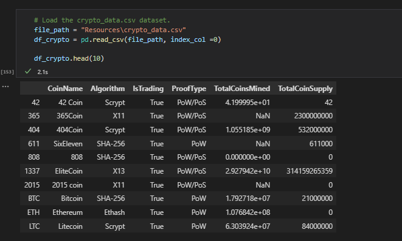
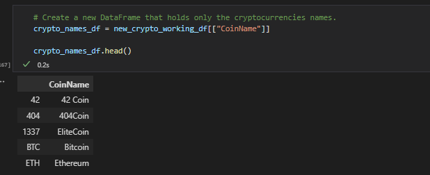
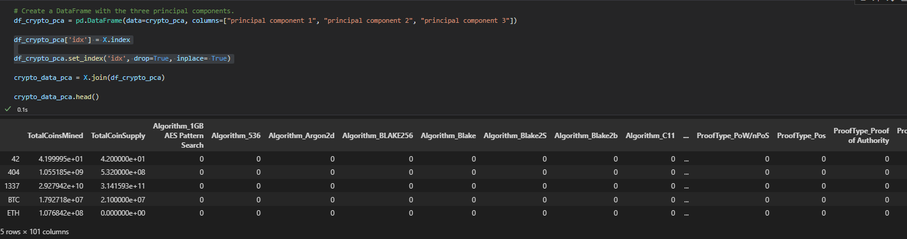

# Cryptocurrencies

## Introduction

Martha is a senior manager for the Advisory Services Team at Accountability Accounting, one of your most important clients. Accountability Accounting, a prominent investment bank, is interested in offering a new cryptocurrency investment portfolio for its customers. The company, however, is lost in the vast universe of cryptocurrencies. So, they’ve asked you to create a report that includes what cryptocurrencies are on the trading market and how they could be grouped to create a classification system for this new investment.

The data Martha will be working with is not ideal, so it will need to be processed to fit the machine learning models. Since there is no known output for what Martha is looking for, she has decided to use unsupervised learning. To group the cryptocurrencies, Martha decided on a clustering algorithm. She’ll use data visualizations to share her findings with the board.

## Data Preparation

The first step of our process is to review the data that Martha has provided.

We load the data into a data structure and look at what was provided:

The first thing we notice is that there are a number of problems with the data:

<ul>
<li>Rows with null values</li>
<li>Rows where the cryptocurrency is not being traded</li>
<li>Rows where no cryptocurrency is has been mined</li>
</ul>

The next thing we realize is that for the model to process correctly, we need to remove the coinname column from the dataset.

We build a temporary dataset which holds the coinname column and the index column.

With the coinname column saved in our temporary structure, we can drop it from our dataset. With this done, we have resolved all of the issues we noticed with the dataset. This leaves us a pretty clean dataset, ready for analysis.

## Analysis

With the clean dataset ready, we start our analysis by utilizing the PCA to lower the number of data dimensions to analyze. After lowing the data dimensions, and rebuilding out dataset, we end up with a new dataset which looks like:  

At this point we can utilize minmaxscaler to help prepare the data for visualization. Once we produce the new scaled data and integrate it back into the dataset, our dataset look like:

With our data ready for visualization, we can build a scatterplot for Martha to show the final dataset. 

